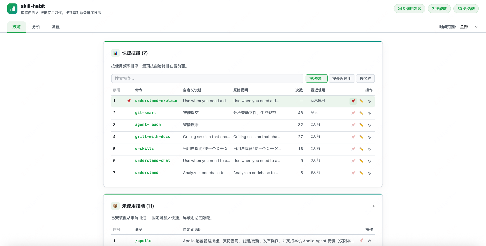
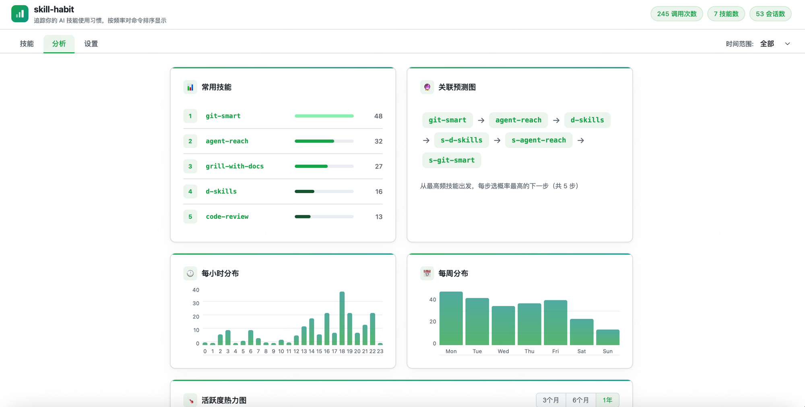
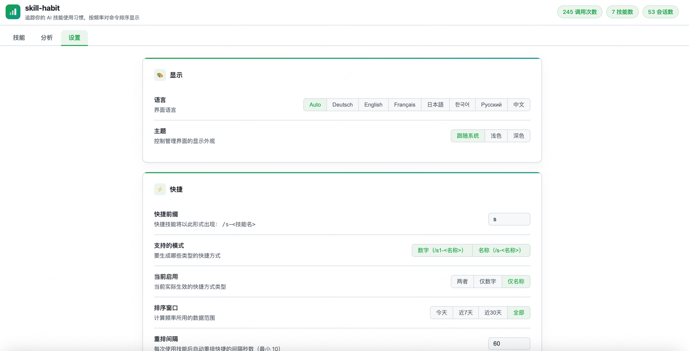

<h1 align="center">skill-habit</h1>

<h3 align="center">Deine Gewohnheiten formen deine Werkzeuge.</h3>

<p align="center">
  Verfolge deine KI-Skill-Nutzungsgewohnheiten — Befehle nach Häufigkeit sortiert, deine meistgenutzten immer an erster Stelle.<br>
  In jeder Sitzung ist der richtige Skill nur einen Tastendruck entfernt — kein Suchen, kein Raten.<br>
  Inklusive Nutzungsanalysen, Aktivitäts-Heatmap, Sequenzvorhersage, Skill-Verwaltung und einem Web-Dashboard.
</p>

<p align="center">
  <a href="README.en.md">English</a> |
  <a href="../README.md">简体中文</a> |
  <a href="README.zh-TW.md">繁體中文</a> |
  <a href="README.de.md">Deutsch</a> |
  <a href="README.fr.md">Français</a> |
  <a href="README.ru.md">Русский</a> |
  <a href="README.ko.md">한국어</a> |
  <a href="README.ja.md">日本語</a>
</p>

<p align="center">
  <a href="#-schnellstart"></a>
  <a href="../LICENSE"></a>
  
  
  
  <a href="https://github.com/kiss4u/skill-habit/stargazers"></a>
</p>

---

## Inhaltsverzeichnis

- [Das Problem](#das-problem)
- [Die Lösung](#die-lösung)
- [✨ Funktionen](#-funktionen)
- [🔒 Datenschutz](#-datenschutz)
- [🚀 Schnellstart](#-schnellstart)
  - [Installation](#installation)
  - [Upgrade](#upgrade)
  - [Konfiguration](#konfiguration)
- [🖥 Verwaltungsplattform](#-verwaltungsplattform)
  - [🗂 Skills-Verwaltung](#-skills-verwaltung)
  - [📊 Analysen](#-analysen)
  - [🛠 Einstellungen](#-einstellungen)
- [🌐 Plattformunterstützung](#-plattformunterstützung)
- [🤝 Mitwirken](#-mitwirken)
- [📄 Lizenz](#-lizenz)

---

## Das Problem

Du hast eine Menge Skills installiert. Jetzt scrollst du bei jedem `/`-Eintippen durch die gesamte Liste, bevor du einen davon nutzen kannst.

## Die Lösung

skill-habit verfolgt jeden Skill, den du aufrufst (nur Metadaten — niemals Prompt-Inhalte).

Bei jedem Sitzungsstart wird ein `/sh-*`-Kürzel-Präfix neu aufgebaut, mit deinen Top-Skills an erster Stelle, beschriftet in deiner bevorzugten Sprache.

Dein meistgenutzter Skill wird zu `/sh-<dein-skill>`, der seit Wochen ungenutzte sinkt nach unten.

Die Liste spiegelt deine meistgenutzten Skills wider — keine bedeutungslose Standardreihenfolge.

---

## ✨ Funktionen

|     | Funktion                             | Beschreibung                                                                                                                                                                                                                                               | Unterstützt auf |
| --- | ------------------------------------ | ---------------------------------------------------------------------------------------------------------------------------------------------------------------------------------------------------------------------------------------------------------- | --------------- |
| 📊  | **Häufigkeitsranking**               | Kürzel werden bei jeder Sitzung basierend auf tatsächlicher Nutzung neu sortiert                                                                                                                                                                           | Claude Code     |
| 📌  | **Anheften**                         | Jeden Skill dauerhaft an erster Stelle fixieren; Reihenfolge mit ↑↓ anpassen                                                                                                                                                                               | Claude Code     |
| 🔮  | **Assoziationsvorhersage**           | Zeigt die Skills, die du typischerweise als nächste verwendest, basierend auf deiner vollständigen Nutzungshistorie                                                                                                                                        | Claude Code     |
| 🌡   | **Aktivitäts-Heatmap**               | GitHub-artiges Aktivitätsraster für Skill-Nutzung; Zeitraum wählbar                                                                                                                                                                                        | Claude Code     |
| 🕐  | **Zeitmuster**                       | Stündliche und wochentägliche Aufschlüsselung, wann du am meisten programmierst                                                                                                                                                                            | Claude Code     |
| 📝  | **Skill-Verwaltung**                 | Alle installierten Skills suchen, sortieren und Beschreibungen bearbeiten                                                                                                                                                                                  | Claude Code     |
| 🚀  | **Update-Prüfung**                   | Prüft beim jedem Öffnen der Benutzeroberfläche automatisch auf Updates; unterscheidet Breaking Changes von Patch-Releases; zeigt Changelog-Hinweise direkt inline und ein dauerhaftes rotes Banner bei wichtigen Updates; Ein-Klick-Upgrade oder Schließen | Claude Code     |
| 🚫  | **Blacklist**                        | Bestimmte Skills vom Häufigkeitsranking und Kürzeln ausschließen; Verwaltung über den Skills-Tab                                                                                                                                                           | Claude Code     |
| 🗂   | **Protokollverwaltung**              | Alte Einträge automatisch kürzen (Standard: 30 Tage); nach Anzahl Tagen bereinigen oder alles über die Benutzeroberfläche löschen                                                                                                                          | Alle            |
| 🌐  | **Mehrsprachige Benutzeroberfläche** | Verwaltungsdashboard auf Chinesisch, Englisch, Deutsch, Französisch, Russisch, Koreanisch und Japanisch, automatisch erkannt                                                                                                                               | Alle            |
| 🔒  | **Datenschutz**                      | Protokolliert nur Skill-Name, Zeit und Sitzungs-ID — niemals deine Prompt-Inhalte                                                                                                                                                                          | Alle            |
| 🔧  | **Bedarfsgesteuerter Server**        | Die Verwaltungsoberfläche startet bei Bedarf und beendet sich beim Schließen des Tabs                                                                                                                                                                      | Alle            |

---

## 🔒 Datenschutz

skill-habit **protokolliert niemals** Prompt-Inhalte, Dateipfade oder Projektnamen.

Protokolleinträge sehen so aus (`~/.skill-habit/skill-usage.log`):

```jsonc
{
  "v": 1,                    // Schema-Version
  "ts": 1719360000,          // Unix-Zeitstempel
  "skill": "git-smart",      // nur der Name — nicht das, was du danach eingegeben hast
  "platform": "claude_code", // welches KI-Tool den Skill aufgerufen hat
  "hour": 14,                // Stunde des Tages (0–23)
  "weekday": 1,              // 0 = Montag
  "session_id": "abc123",    // identifiziert eine zusammenhängende Programmiersitzung
  "session_skill_seq": 3,    // Position innerhalb der Sitzung (1, 2, 3…)
  "project_hash": "a3f2c1",  // Einweg-Hash, nicht umkehrbar
  "args_len": 42             // nur Zeichenanzahl, niemals Inhalt
}
```

Protokolleinträge, die älter als `log_retention_days` (Standard: 30) sind, werden bei jeder Sitzung automatisch gelöscht. Du kannst auch über **Einstellungen → Datenverwaltung** eine Anzahl von Tagen eingeben (0 = alles löschen), um aufzuräumen.

---

## 🚀 Schnellstart

> **Voraussetzungen:** macOS oder Linux · Python 3.9+ · git
>
> **Windows:** Noch nicht nativ unterstützt. Nutze [WSL](https://learn.microsoft.com/windows/wsl/) als Workaround.

### Installation

**Option A — Claude Code Plugin-Installation (empfohlen)**

```bash
claude plugins install github:kiss4u/skill-habit
```

Starte Claude Code nach der Installation neu — das Tracking beginnt sofort.

**Option B — Einzeilen-Installation**

```bash
curl -sSL https://raw.githubusercontent.com/kiss4u/skill-habit/main/scripts/bootstrap.sh | bash
```

**Option C — pipx / pip**

> Hinweis: Diese Methode installiert keine eingebauten Skills (`/skill-habit:quick`, `/skill-habit:server` usw.). Option A oder B wird empfohlen.

pipx (empfohlen — hält es isoliert):
```bash
pipx install git+https://github.com/kiss4u/skill-habit
skill-habit install
```

pip:
```bash
pip install git+https://github.com/kiss4u/skill-habit
skill-habit install
```

> Starte eine neue Claude Code-Sitzung — die Verfolgung beginnt sofort.

**Andere Plattformen**

Cursor, Codex CLI, Gemini CLI und weitere sind geplant. Siehe den Abschnitt „Mitwirken", um einen Adapter hinzuzufügen.

**Die Verwaltungsoberfläche öffnen**

Nach der Installation das Dashboard mit einer dieser Methoden öffnen:

In Claude Code:
```bash
/skill-habit:server
```

pip / pipx Installation:
```bash
skill-habit server
```

bootstrap / Klon-Installation:
```bash
python3 ~/.local/share/skill-habit/ui/server.py
```

Der Browser öffnet sich automatisch. Der Server beendet sich nach 5 Minuten Inaktivität.

---

### Upgrade

Verwende denselben Befehl wie bei der Installation — jede Methode behandelt Upgrades automatisch:

**Option A — Claude Code Plugin**

```bash
claude plugins update skill-habit
```

**Option B — Einzeiler**

```bash
curl -sSL https://raw.githubusercontent.com/kiss4u/skill-habit/main/scripts/bootstrap.sh | bash
```

Wird Bootstrap erneut auf einer bestehenden Installation ausgeführt, erkennt es das `.git`-Verzeichnis und führt `git pull` statt einer Neuinstallation aus.

**Option C — pipx / pip**

pipx:
```bash
pipx upgrade skill-habit
skill-habit install
```

pip:
```bash
pip install --upgrade git+https://github.com/kiss4u/skill-habit
skill-habit install
```

Du kannst auch direkt im Panel **Einstellungen → Version & Upgrade** der Verwaltungsoberfläche nach Updates suchen und mit einem Klick upgraden.

---

### Konfiguration

**Kürzel-Präfix**

Das **Kürzel-Präfix** ist der Namensraum für alle von skill-habit generierten Kürzel — der Standard ist `sh`. Jede Sitzung werden Kürzel in einem oder beiden der folgenden Modi erstellt (konfigurierbar):

| Modus         | Format                   | Beispiel (Präfix `sh`)    | Hinweise                                                                                                                            |
| ------------- | ------------------------ | ------------------------- | ----------------------------------------------------------------------------------------------------------------------------------- |
| **Numerisch** | `/<präfix><N×rang>`      | `/sh1`, `/sh22`, `/sh333` | Häufigkeitssortiert; `/sh1` zeigt immer auf den aktuell meistgenutzten Skill; Assoziationsvorhersage wird jede Sitzung aktualisiert |
| **Befehl**    | `/<präfix>-<skill-name>` | `/sh-git-smart`           | Skills direkt nach Name aufrufen; Menüreihenfolge wird von Claude Code alphabetisch festgelegt, unabhängig von der Häufigkeit       |

Gehe zu **Einstellungen → Allgemein → Kürzel-Präfix**, gib einen neuen Wert ein und speichere — die Kürzel werden sofort neu aufgebaut. Die Benutzeroberfläche erkennt Konflikte in Echtzeit und zeigt konfliktfreie Alternativen unterhalb des Eingabefelds an, die du mit einem Klick übernehmen kannst.

**Formatregeln:** Nur Buchstaben, Ziffern, `-` und `_`; maximal 5 Zeichen.

**Integrierte skill-habit-Skills**

Die folgenden Verwaltungs-Skills sind als Plugin eingebaut und immer verfügbar, unabhängig vom Präfix:

| Skill                  | Beschreibung                                    | Wann verwenden                                                                                                                       |
| ---------------------- | ----------------------------------------------- | ------------------------------------------------------------------------------------------------------------------------------------ |
| `/skill-habit:quick`   | Aktuelles Präfix und numerische Kürzel anzeigen | Präfix oder Shortcut-Zuordnung vergessen? Ausgabe z. B.: `Präfix: sh`, `/sh1 → git-smart`                                            |
| `/skill-habit:server`  | Web-Verwaltungsoberfläche im Browser öffnen     | Einstellungen ändern, Analysen ansehen, Skills verwalten; Browser öffnet automatisch, Server beendet sich nach 5 Minuten Inaktivität |
| `/skill-habit:rebuild` | Shortcuts sofort neu generieren                 | Nach manueller Bearbeitung von `~/.skill-habit/config.json`; Änderungen über das Web UI lösen automatisch ein Rebuild aus            |
| `/skill-habit:version` | Installierte Version anzeigen                   | Versionsnummer bei Fehlersuche oder Bug-Report bestätigen                                                                            |

**config.json**

`~/.skill-habit/config.json` — bearbeitbar über die Benutzeroberfläche oder direkt:

```jsonc
{
  "prefix": "sh",                      // Kürzel-Präfix: /sh-*
  "top_n": 10,                         // maximale Anzahl generierter Befehlskürzel pro Sitzung
  "numeric_n": 5,                      // maximale Anzahl generierter numerischer Kürzel (sh1…shN)
  "time_window": "all",                // "today" | "week" | "month" | "all"
  "shortcut_mode": "both",             // "numeric" (/sh1) | "command" (/sh-<name>) | "both"
  "enable_sequence_prediction": true,  // Assoziationsvorhersage — siehe Hinweis unten
  "prediction_n": 5,                   // maximale Kandidaten für die Vorhersage (1–5)
  "top_skills_n": 10,                  // Zeilen im Top-Skills-Diagramm
  "pinned_skills": [],                 // immer zuerst, unabhängig von der Häufigkeit
  "log_retention_days": 30,            // rollierendes Fenster; 0 = für immer aufbewahren
  "theme": "system",                   // "light" | "dark" | "system"
  "language": "auto",                  // "zh" | "en" | "de" | "fr" | "ru" | "ko" | "ja" | "auto"
  "analytics_cards": {                 // einzelne Karten in der Benutzeroberfläche umschalten
    "heatmap": true,                   // Aktivitätsraster
    "top_skills": true,                // Häufigkeits-Balkendiagramm
    "transition_graph": true,          // Skill-Verkettungsmuster
    "hourly_distribution": true,       // wann im Tagesverlauf du am meisten programmierst
    "weekday_distribution": true       // an welchen Tagen du am meisten programmierst
  }
}
```

**🔮 Assoziationsvorhersage (Intelligente Sortierung)**

Wenn `enable_sequence_prediction` aktiviert ist, führt das System bei jedem Sitzungsstart folgendes aus:

1. Liest den zuletzt verwendeten Skill
2. Fragt die historische Übergangsmatrix ab, um die 3 wahrscheinlichsten nächsten Skills vorherzusagen
3. Hebt diese 3 Skills an die Spitze der Kürzel-Liste

Wirksamkeit hängt vom Kürzelmodus ab:

| Modus                        | Auswirkung                                                                                                                                              |
| ---------------------------- | ------------------------------------------------------------------------------------------------------------------------------------------------------- |
| **Numerisch** (`/sh1 /sh2…`) | Die Vorhersage ändert direkt, welcher Skill `sh1`/`sh2` belegt. Die Eingabe von `/sh1` führt immer den empfohlenen Skill aus. **Vollständig wirksam.** |
| **Befehl** (`/sh-<name>`)    | Die Menüreihenfolge ist von Claude Code alphabetisch festgelegt — die Vorhersage **hat keinen Einfluss auf die Menüreihenfolge**.                       |

> Die Genauigkeit verbessert sich mit zunehmenden Daten. Ergebnisse sind nach 20+ Sitzungen aussagekräftig.

**📐 Sortierung numerischer Kürzel**

Claude Codes Autovervollständigung sortiert Vorschläge hauptsächlich nach **Gesamtlänge des Namens** — kürzere Namen erzielen höhere Punkte und erscheinen zuerst. skill-habit generiert numerische Kürzel mit **streng zunehmenden Namenslängen**, indem die Rangziffer N-mal wiederholt wird:

| Rang              | Kürzel    | Länge     |
| ----------------- | --------- | --------- |
| 1 (am häufigsten) | `sh1`     | 2 Zeichen |
| 2                 | `sh22`    | 3 Zeichen |
| 3                 | `sh333`   | 4 Zeichen |
| 4                 | `sh4444`  | 5 Zeichen |
| 5                 | `sh55555` | 6 Zeichen |

Dies garantiert, dass das Dropdown Kürzel in der Häufigkeitsreihenfolge anzeigt. Wenn sich deine Nutzungsmuster ändern, werden die Kürzeluweisungen beim nächsten Sitzungsstart automatisch aktualisiert.

Aufruf: `/sh1` direkt eingeben oder `/sh2` (Fuzzy-Match auf `sh22`) und Enter drücken.

---

## 🖥 Verwaltungsplattform

### 🗂 Skills-Verwaltung

<a href="../assets/screenshot-skills.png"></a>

Öffne den **Skills**-Tab, um:

- **Suchen & Sortieren** — nach Name/Beschreibung filtern; nach Nutzungsanzahl, zuletzt verwendet oder Name sortieren (nochmals auf denselben Button klicken zum Umkehren)
- **Beschreibungen bearbeiten** — Doppelklick auf die Beschreibung zum direkten Bearbeiten (oder auf das ✏️-Symbol beim Hover klicken); Enter oder Klick außerhalb zum Speichern, Esc zum Abbrechen
- **Skills anheften** — einen Skill anheften, um ihn dauerhaft an erster Stelle deiner Kürzel zu fixieren; ↑↓ zum Neuanordnen angehefteter Skills verwenden
- **Skills auf die Blacklist setzen** — auf **Blockieren** in einer Zeile klicken, um einen Skill vom Häufigkeitsranking und den Kürzeln auszuschließen; die Blacklist (anzeigen, blättern, entsperren) im ausklappbaren Blacklist-Bereich am Ende des Tabs verwalten
- **Nutzungshistorie** — sehen, wie oft du jeden Skill genutzt hast und wann du ihn zuletzt verwendet hast

> Der Skills-Tab zeigt nur Skills, die du mindestens einmal verwendet hast. Skills werden aus `~/.claude/skills/` und allen installierten Plugins bezogen.

### 📊 Analysen

<a href="../assets/screenshot-analytics.png"></a>

Der **Analysen**-Tab umfasst:

- **Aktivitäts-Heatmap** — Raster im GitHub-Stil; jede Zelle = Skill-Aufrufe an diesem Tag; Zeitraum wählbar
- **Top-Skills** — Balkendiagramm für das gewählte Zeitfenster (heute / Woche / Monat / gesamte Zeit)
- **Stundenverteilung** — wann im Tagesverlauf du Skills verwendest
- **Wochentagsverteilung** — an welchen Tagen du am meisten programmierst
- **Übergangsgraph** — welche Skills du miteinander verkettest (dient dem Vorhersagemodell)

Jede Karte kann in den Einstellungen einzeln ein- oder ausgeblendet werden.

### 🛠 Einstellungen

<a href="../assets/screenshot-settings.png"></a>

Der **Einstellungen**-Tab enthält drei Karten, Änderungen treten sofort in Kraft:

**Allgemein**

| Einstellung                   | Beschreibung                                                                                                               |
| ----------------------------- | -------------------------------------------------------------------------------------------------------------------------- |
| Kürzel-Präfix                 | Namensraum für alle Kürzel-Skills, Standard `sh`; erkennt Konflikte in Echtzeit und schlägt konfliktfreie Alternativen vor |
| Zeitfenster                   | Zeitraum für die Häufigkeitsanalyse: Alle / Letztes Halbjahr / Diesen Monat / Diese Woche / Heute                          |
| Kürzelmodus                   | Welche Kürzeltypen aktiviert werden: Numerisch (`/sh1`), Benannt (`/sh-name`) oder Beide                                   |
| Anzahl numerischer Kürzel     | Maximale Anzahl generierter numerischer Kürzel (1–9)                                                                       |
| Anzahl benannter Kürzel       | Maximale Anzahl generierter benannter Kürzel                                                                               |
| Zeilen im Top-Skills-Diagramm | Anzahl der Skills im Analytics-Balkendiagramm                                                                              |
| Neuaufbau-Intervall           | Minuten der Inaktivität bis zur automatischen Neustrukturierung der Kürzel                                                 |
| Sequenzvorhersage             | Sagt den nächsten wahrscheinlichen Skill aus der Nutzungshistorie voraus                                                   |
| Vorhersagetiefe               | Wie viele Skills die Sequenzvorhersage befördern darf (1–5)                                                                |
| Design                        | Hell / Dunkel / System                                                                                                     |
| Sprache                       | Oberflächensprache: Auto / 中文 / English / Deutsch / Français / Русский / 한국어 / 日本語                                 |
| Analysekarten-Schalter        | Einzeln ein-/ausblenden: Heatmap, Top-Skills, Übergangsgraph, Stundenverteilung, Wochentagsverteilung                      |

**Datenverwaltung**

| Einstellung                | Beschreibung                                                                                           |
| -------------------------- | ------------------------------------------------------------------------------------------------------ |
| Protokollaufbewahrungstage | Gleitendes Aufbewahrungsfenster (0 = für immer aufbewahren); Bereinigung nach Tagen oder alles löschen |

**Version & Upgrade**

| Status              | Verhalten                                                                       |
| ------------------- | ------------------------------------------------------------------------------- |
| Kein Update         | Stille Prüfung, keine Benachrichtigung                                          |
| Patch-Update        | Gelber Hinweis nur in dieser Karte — kein Banner                                |
| Major-/Minor-Update | Rotes Banner oben auf der Seite mit Changelog; Upgrade per Klick oder Schließen |

---

## 🌐 Plattformunterstützung

| Plattform      | Status     |
| -------------- | ---------- |
| Claude Code    | ✅ v0.0.1  |
| Cursor         | 🔜 geplant |
| Codex CLI      | 🔜 geplant |
| Gemini CLI     | 🔜 geplant |
| GitHub Copilot | 🔜 geplant |
| OpenCode       | 🔜 geplant |
| Windsurf       | 🔜 geplant |

---

## 🤝 Mitwirken

1. Forke dieses Repository
2. Wähle eine Plattform in `adapters/` (oder schlage eine neue vor)
3. Implementiere die drei Methoden in `adapters/base.py`
4. Öffne einen PR

---

## 📄 Lizenz

MIT © [kiss4u](https://github.com/kiss4u)
